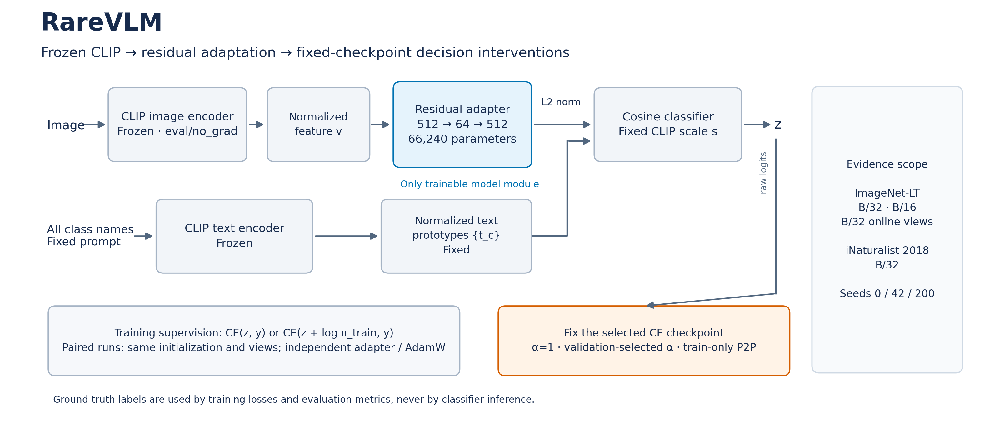
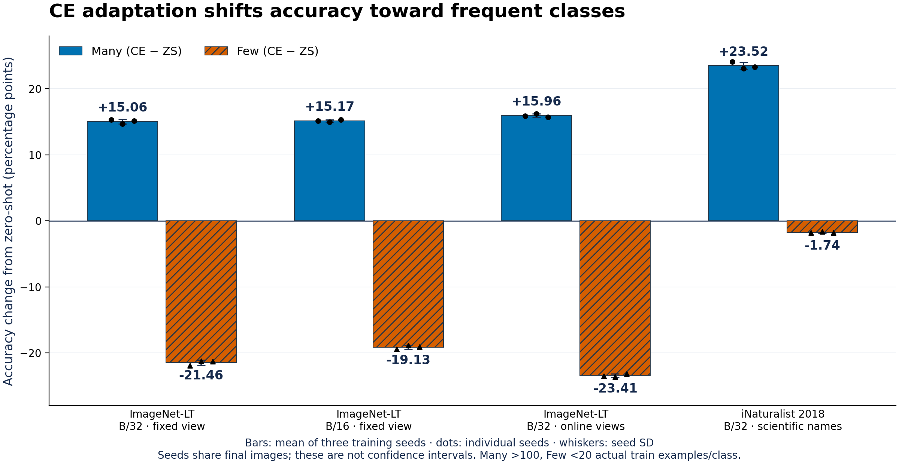

# RareVLM

### Long-Tailed Vision-Language Model Adaptation

An independent CV/VLM research engineering project that measures how long-tailed supervision changes CLIP's head/tail balance, and how much performance can be recovered while holding adapted representations fixed.

[](https://github.com/0heng3/RareVLM/actions/workflows/ci.yml)


**Research experiments are frozen.** This release improves presentation, auditability and software checks around the completed study.



## Why RareVLM

CLIP already provides a zero-shot reference. Does ordinary CE supervision preserve that balance when the downstream training set is long-tailed? RareVLM answers this with paired residual-adapter runs, fixed-checkpoint interventions, and checks across complete checkpoints, training views and two real long-tailed datasets.

## Key findings

1. **CE produces a head/tail tradeoff.** On ImageNet-LT B/32, Many accuracy increases **15.06 pp**, while Few decreases **21.46 pp** over three training seeds.
2. **A fixed CE representation can recover performance.** Validation-selected prior correction raises OA/Few from **61.38/37.76%** to **65.36/61.23%** without updating the adapter, encoders or text prototypes.
3. **The direction repeats under different settings.** Complete B/16 and online crop/flip training reproduce it on ImageNet-LT; iNaturalist 2018 also shows CE Many↑/Few↓ and improvements from some fixed-CE corrections.
4. **Correction strength is conditional.** iNaturalist selects **α=0.25 in 3/3 seeds**; fixed α=1 improves Few but loses **1.05 pp OA**. Unit-strength empirical correction is not universal.



## Main results

Accuracy in %, mean of seeds `{0,42,200}`. ZS is a deterministic reference. Every row below uses **validation-selected CE calibration**; individual α values and all fixed-strength/P2P controls are in the [machine-readable table](results/main_results.csv).

| Setting | ZS OA / Few | CE OA / Few | LA OA / Few | Fixed CE + val-α OA / Few |
| --- | ---: | ---: | ---: | ---: |
| ImageNet-LT · B/32 · fixed view | 59.42 / 59.22 | 61.38 / 37.76 | 65.97 / 59.01 | 65.36 / 61.23 |
| ImageNet-LT · B/16 · fixed view | 63.99 / 63.35 | 67.20 / 44.23 | 71.04 / 63.73 | 70.83 / 64.57 |
| ImageNet-LT · B/32 · online views | 59.42 / 59.22 | 61.54 / 35.81 | 66.64 / 59.28 | 66.11 / 62.90 |
| iNaturalist 2018 · B/32 · fixed view | 3.48 / 3.32 | 5.05 / 1.57 | 5.69 / 3.70 | 5.35 / 2.48 |

iNaturalist uses 8,142 official scientific-name prototypes. Its approximately **3.48–6.01% OA** under this frozen-encoder/fixed-classifier setup reflects limited absolute recognition ability; these are controlled research results, not deployment or SOTA claims. Official val is locked for final top-1 research evaluation, with selection confined to held-out official-train images. [Full results and boundaries](docs/RESULTS.md).

## Quick start

Python 3.10/3.11; run from repository root.

```bash
python -m venv .venv
source .venv/bin/activate
pip install -r requirements.txt
python smoke.py
```

This is a **CPU-only synthetic execution check**, with no image/model download. It exercises actual CE/LA training, validation selection, checkpoint saving and fixed-checkpoint controls. Its numbers are not research evidence. For a CPU-only PyTorch installation, install torch/torchvision from the [official CPU wheel index](https://download.pytorch.org/whl/cpu) before the remaining requirements.

```bash
pip install -r requirements-dev.txt
python -m pytest -q
python tools/check_release.py
```

The [CI workflow](.github/workflows/ci.yml) runs tests and smoke on CPU with Python 3.10 and 3.11. The badge reflects actual GitHub Actions status.

Local verification passed **19 synthetic contract tests**, the CPU smoke and the release-data/hash checker. Hosted CI is configured; its initial run was blocked before runner allocation by an account-level restriction, so no hosted-CI pass is claimed.

## Experimental design and reproduction

- Frozen CLIP image/text encoders; single `a photo of a {}.` prompt; normalized, fixed text prototypes and original logit scale.
- Zero-initialized residual **512→64→512** LN/GELU adapter: **66,240 trainable parameters**, exact identity at initialization.
- Paired CE/LA initialization, sample order, budget and selection. LA uses `CE(z + log π_train, y)`, τ=1; final evaluation uses raw z.
- Online training binds crop/flip RNG to `(seed, epoch, sample_index)` and shares one frozen CLIP image encoding between independent adapters/AdamW states. Final views have no augmentation or TTA.

[Protocol](docs/PROTOCOL.md) · [ImageNet-LT / B/16 / online / iNaturalist commands](docs/REPRODUCE.md) · [Four frozen configuration snapshots](configs/imagenet_lt_b32.json).

The JSON configurations document settings; existing runners use CLI commands in `REPRODUCE.md`. Paths default to project-local `data/` and `artifacts/`, with CLI/environment overrides. Dataset images and model weights are acquired separately; [asset preparation](prepare_assets.py) checks pinned weights and the official iNaturalist species table.

## Analysis

[docs/ANALYSIS.md](docs/ANALYSIS.md) contains deeper evidence: ZS→CE error transitions, effective versus empirical priors, margins against fixed ZS competitors, representation drift/alignment, and the limits of causal interpretation. Source mechanisms and execution status are in [MECHANISMS.md](docs/MECHANISMS.md).

## Reproducibility & auditability

- [main_results.csv](results/main_results.csv): 28 final setting/method summaries; [seed_results.csv](results/seed_results.csv): 76 setting/seed records, including the reused ZS baseline.
- [provenance.json](results/provenance.json): model, manifest, ordered split and source-result hashes; prompt, seed, protocol and selection identity. Tables are generated by [export_results.py](tools/export_results.py) from completed JSON records.
- [Figure provenance](assets/figure_provenance.json): source CSV hash, transformations, mean/SD definition, individual seed values and exported image hashes.
- [Research code lock](results/research_code_lock.json): original runnable research modules stay frozen. [SOURCE_ORIGINS](SOURCE_ORIGINS.json) records source/portable hashes and path-related changes.
- [PACKAGE_MANIFEST](PACKAGE_MANIFEST.json): SHA-256 for release files. [check_release.py](tools/check_release.py) checks tables, images, links and file hashes.
- [tests/](tests): exact identity/parameter budget, label-free classifier API, frozen prototypes, LA semantics, split separation, immutable calibration inputs, and online view pairing across RNG states/workers.

## Research context

Questions from **TS-MOF / AES / GALE** motivated the study. The final VLM main matrix focused on CE/LA and existing fixed-checkpoint corrections. TailSpec-static was tested only in the CIFAR pilot; ARS, E-PCG, RD-PCGrad, GES and multi-expert fusion were not VLM main-matrix comparisons. Context includes [Logit Adjustment](https://openreview.net/forum?id=37nvvqkCo5), [LIFT](https://proceedings.mlr.press/v235/shi24g.html), and [Prior2Posterior](https://openaccess.thecvf.com/content/WACV2025/html/Bhat_Prior2Posterior_Model_Prior_Correction_for_Long-Tailed_Learning_WACV_2025_paper.html). No new calibration algorithm is claimed.

## Scope & limitations

Fixed-representation recovery establishes that decision interventions can help; it does not identify a unique causal source or prove representations are undamaged. B/32/B/16 change the complete CLIP checkpoint. Dataset, class count, domain and name system also vary. Shared final images make seed×image pairs dependent, and iNaturalist has only three final images per class. Downstream split separation cannot prove absence of CLIP pretraining overlap. Untested optimization candidates are not ranked or declared ineffective.

## Repository layout

```text
assets/       overview, result figure and figure provenance
results/      aggregate/seed CSV, experiment provenance, research-code lock
configs/      four frozen protocol snapshots
tests/        CPU software contracts using synthetic inputs
tools/        result export, plotting, package/check tools
docs/         protocol, results, reproduction, mechanisms and deeper analysis
methods.py    adapter, fixed prototype classifier, CE/LA/TailSpec-static
extract_*.py, run_*.py, calibrate.py, smoke.py
.github/      Python 3.10/3.11 CPU CI
```

## License & citation

License publication is pending the maintainer's confirmation. Software citation metadata is provided in [CITATION.cff](CITATION.cff). Third-party datasets, model weights and source-project archives are obtained separately.
